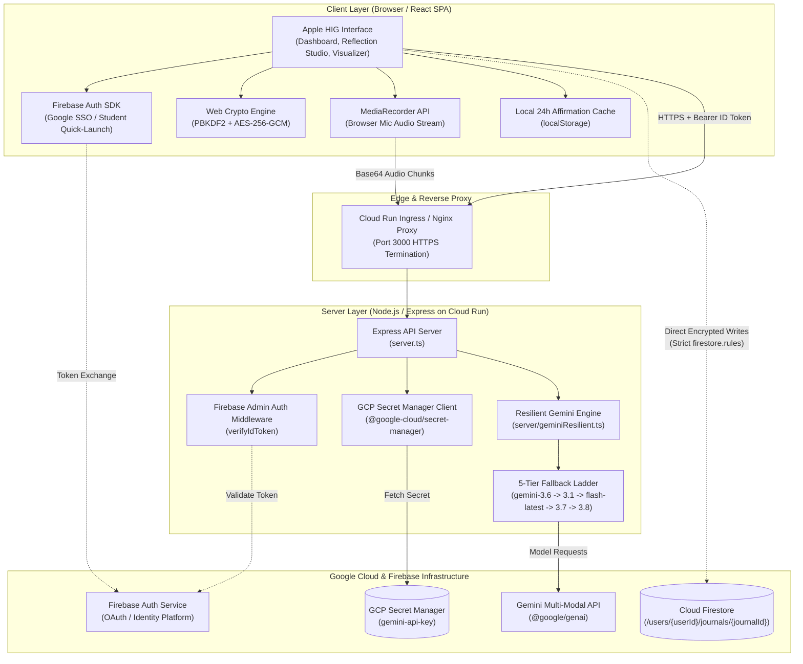
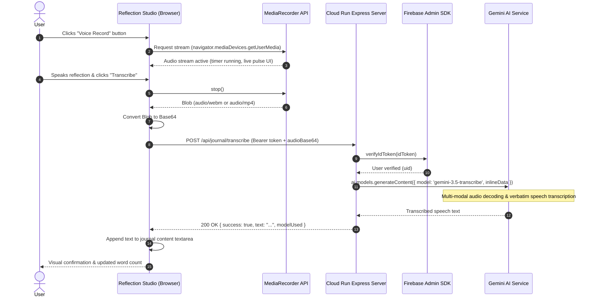
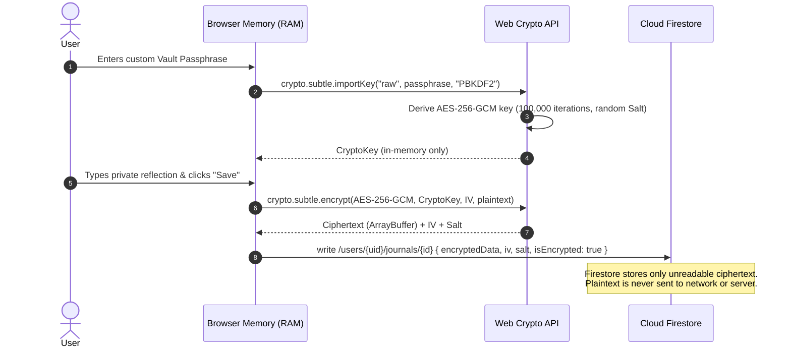
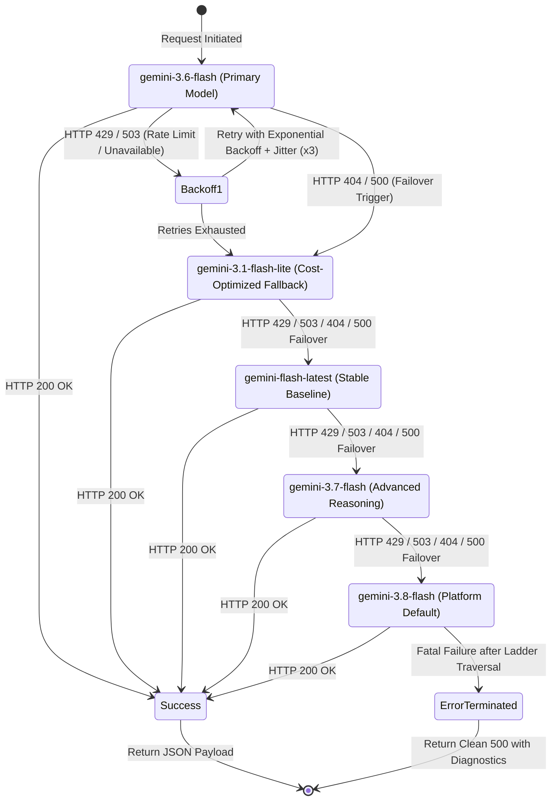
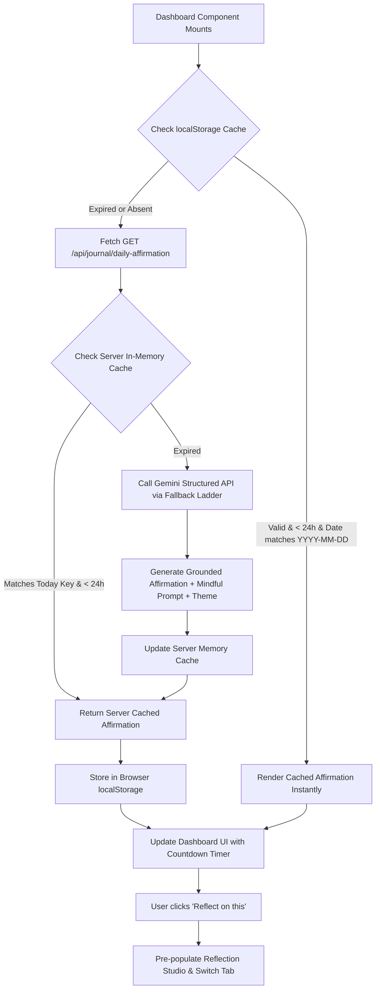

# System Architecture & Technical Specifications

> **Application**: Personal Gemini Journal  
> **Target Platform**: Google Cloud Run (`#AccelerateAIwithCloudRun`)  
> **Core Technologies**: React 18 (Vite), TypeScript, Tailwind CSS, Express, `@google/genai`, Google Cloud Secret Manager, Cloud Firestore, Firebase Authentication, Web Crypto API (AES-256-GCM + PBKDF2), MediaRecorder API.

---

## 1. High-Level System Architecture

The **Personal Gemini Journal** is architected as an enterprise-grade, privacy-first, full-stack application deployed on Google Cloud Run. It combines an Apple Human Interface Guidelines (HIG) client interface with server-side AI processing, zero-knowledge client encryption, and isolated cloud persistence.



---

## 2. Component & Layer Breakdown

### Layer 1: Client Layer (SPA)
- **Framework**: React 18 with Vite and TypeScript.
- **Design System**: Apple HIG with continuous squircle radii (`rounded-2xl`, `rounded-3xl`), dynamic multi-layer glassmorphism (`backdrop-blur-2xl`), SF font hierarchy, and fluid spring physics via `motion/react`.
- **Public Gate**: Unauthenticated users are strictly quarantined to a high-converting public landing page. All internal dashboards, studios, cognitive tools, and state remain completely unmounted until authenticated.
- **Zero-Knowledge Encryption Module (`src/lib/crypto.ts`)**: Encrypts and decrypts user reflections locally in the browser memory using the native Web Crypto API. Passphrases never leave client memory.
- **Voice Dictation Module (`src/components/ReflectionStudio.tsx`)**: Captures real-time speech using `navigator.mediaDevices.getUserMedia` and the `MediaRecorder` API with dynamic MIME-type negotiation (`audio/webm`, `audio/mp4`).

### Layer 2: Server Layer (Express on Cloud Run)
- **Container Target**: Google Cloud Run with single port 3000 ingress.
- **Payload Handling**: Configured with extended `25mb` JSON and URL-encoded limits to safely handle multi-modal voice payloads.
- **Authentication Verification (`server/firebaseAdmin.ts`)**: Server-side token guard (`verifyIdToken`) inspecting the `Authorization: Bearer <token>` header for all private journal endpoints (`/api/journal/reflect`, `/api/journal/analyze`, `/api/journal/transcribe`, `/api/journal/sync-audit`).
- **Resilient AI Controller (`server/geminiResilient.ts`)**: Orchestrates the multi-model fallback ladder, crisis distress guardrails, recursive input sanitization, and structured JSON output parsing.
- **Secret Resolution (`server/secrets.ts`)**: Dynamically resolves the Gemini API key from Google Cloud Secret Manager with fallback to environment configuration.

### Layer 3: Managed Cloud Services
- **Cloud Firestore**: Stores owner-partitioned documents strictly under `/users/{userId}/journals/{journalId}`.
- **Google Cloud Secret Manager**: Encrypted secret storage for production API keys (`projects/PROJECT_ID/secrets/gemini-api-key`).
- **Gemini Multi-Modal Models**: Processes conversational reflections, cognitive pattern extractions, speech-to-text transcriptions, and daily affirmations.

---

## 3. Data Flow & Sequence Architecture

### 3.1 Voice Dictation & Audio Processing Pipeline



---

### 3.2 Client-Side Zero-Knowledge Encryption Flow



---

### 3.3 Gemini Multi-Model Fallback Ladder & Error Recovery Matrix

To guarantee high availability and prevent single-point-of-failure failures (such as quota rate limits or transient model maintenance), every AI request traverses our automated resilience ladder:



---

### 3.4 Daily Affirmations 24-Hour Lifecycle



---

## 4. Security & Isolation Architecture

### 4.1 Threat Zone Defense Matrix

```
┌─────────────────────────────────────────────────────────────────────────────┐
│                            THREAT DEFENSE SURFACE                           │
├──────────────────────────┬──────────────────────────────────────────────────┤
│ Zone 1: Input Surfaces   │ • Recursive string sanitization                  │
│                          │ • Strict bounds (Title ≤ 200, Content ≤ 12,000) │
│                          │ • Typed responseSchema (Type.OBJECT) via Gemini  │
│                          │ • Context isolation: user data in XML delimiters │
├──────────────────────────┼──────────────────────────────────────────────────┤
│ Zone 2: Planning & Logic │ • Non-clinical, empathetic mindfulness boundaries│
│                          │ • 5-tier fallback ladder with backoff & jitter   │
│                          │ • Real-time crisis detection (distressScore ≥0.7)│
│                          │ • 4-7-8 Breathing Pacer grounding intervention   │
├──────────────────────────┼──────────────────────────────────────────────────┤
│ Zone 3: Tool Execution   │ • Geolocation latitude/longitude boundary checks │
│                          │ • Environmental tag whitelisting                 │
│                          │ • Google Maps API restricted to HTTP referrers   │
├──────────────────────────┼──────────────────────────────────────────────────┤
│ Zone 4: Memory & State   │ • Firestore rules: request.auth.uid == userId   │
│                          │ • Zero-Knowledge client AES-256-GCM encryption   │
│                          │ • PBKDF2 key derivation (100,000 SHA-256 rounds) │
│                          │ • Zero medical diagnosis stored to persistence   │
├──────────────────────────┼──────────────────────────────────────────────────┤
│ Zone 5: Inter-System     │ • Zero API keys in frontend bundle or client repo│
│                          │ • Dynamic GCP Secret Manager secret resolution   │
│                          │ • Firebase Admin SDK verifyIdToken on all APIs   │
│                          │ • 25MB body parser limit with type validation    │
└──────────────────────────┴──────────────────────────────────────────────────┘
```

### 4.2 Cloud Firestore Security Boundary

All user documents are partitioned strictly by authentication ID. Cross-tenant access is structurally impossible at the database engine level:

```
/users/{userId}                         <-- Root user document
  └── /journals/{journalId}             <-- Private reflections collection
```

Enforced by `firestore.rules`:
```javascript
rules_version = '2';
service cloud.firestore {
  match /databases/{database}/documents {
    function isAuthenticated() {
      return request.auth != null;
    }
    function isOwner(userId) {
      return isAuthenticated() && request.auth.uid == userId;
    }
    match /users/{userId} {
      allow read, write: if isOwner(userId);
      match /journals/{journalId} {
        allow read, write: if isOwner(userId);
      }
    }
    match /{document=**} {
      allow read, write: if false;
    }
  }
}
```

---

## 5. Deployment Topology on Google Cloud Run

```
                                  INTERNET
                                     │
                                     ▼
                  ┌───────────────────────────────────────┐
                  │ Google Cloud Load Balancer / SSL      │
                  └──────────────────┬────────────────────┘
                                     │ HTTPS
                                     ▼
┌─────────────────────────────────────────────────────────────────────────────┐
│ GOOGLE CLOUD RUN SERVICE (Managed Container)                                │
│ Region: us-central1 / Label: dev-tutorial=cloud-run-ai-challenge             │
│                                                                             │
│   ┌─────────────────────────────────────────────────────────────────────┐   │
│   │ Express Server (server.ts)                                          │   │
│   │  ├── Port 3000 Ingress                                              │   │
│   │  ├── Static Assets / SPA Fallback (dist/)                           │   │
│   │  └── REST API Handlers (/api/*)                                     │   │
│   └──────────────────┬─────────────────────────────┬────────────────────┘   │
└──────────────────────┼─────────────────────────────┼────────────────────────┘
                       │                             │
       IAM: roles/secretmanager.secretAccessor       │ HTTPS / gRPC
                       ▼                             ▼
        ┌─────────────────────────────┐  ┌────────────────────────────────────┐
        │ Google Cloud Secret Manager │  │ Gemini API (@google/genai)         │
        │ Secret: gemini-api-key      │  │ Models: 3.6-flash, 3.5-transcribe  │
        └─────────────────────────────┘  └────────────────────────────────────┘
```

---

## 6. Verification & Auditing Endpoints

| Endpoint | Method | Security | Purpose |
| :--- | :--- | :--- | :--- |
| `/api/health` | `GET` | Public | Returns service status, runtime environment, Secret Manager status, and Firebase Admin health. |
| `/api/config` | `GET` | Public | Provides safe client-facing Firebase project configuration without exposing private keys. |
| `/api/journal/reflect` | `POST` | `Bearer <idToken>` | Multi-turn AI reflection with crisis distress evaluation. |
| `/api/journal/analyze` | `POST` | `Bearer <idToken>` | Deep cognitive pattern and emotional valence analysis. |
| `/api/journal/transcribe`| `POST` | `Bearer <idToken>` | Speech-to-text audio transcription via Gemini audio models. |
| `/api/journal/daily-affirmation`| `GET` | Public / Cached | 24-hour resetting daily affirmation and mindful inquiry. |
| `/api/journal/sync-audit`| `POST` | `Bearer <idToken>` | Server-side audit verifying zero-knowledge payload compliance. |
