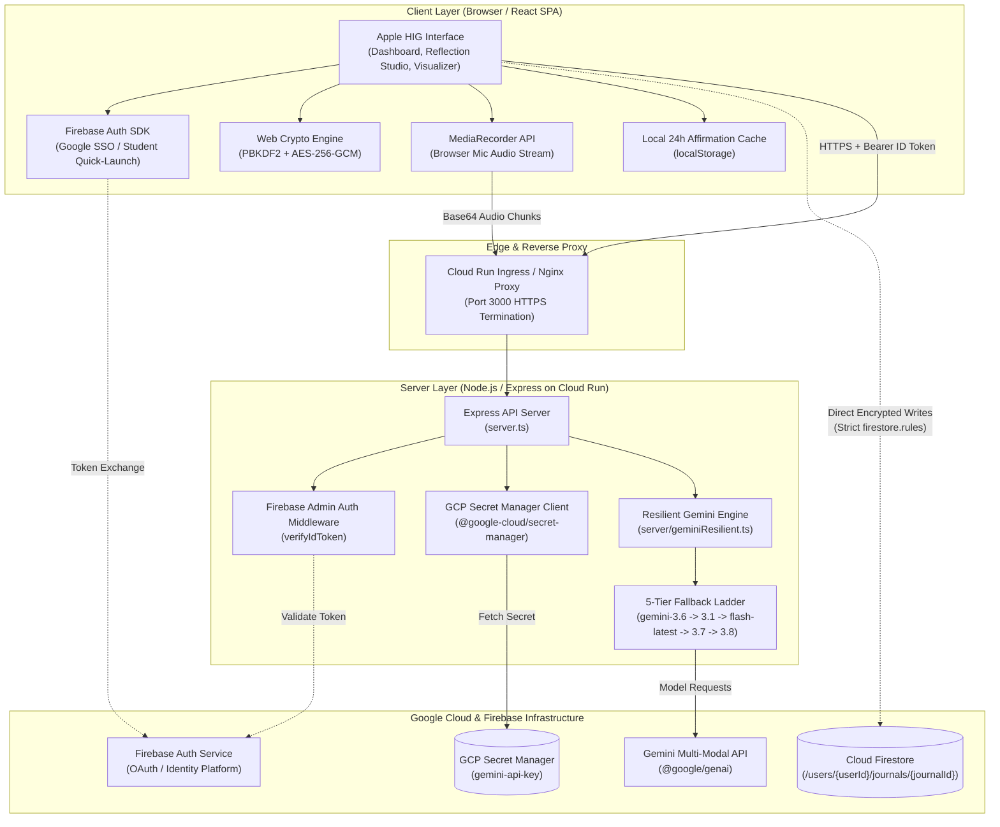

# Personal Gemini Journal

> An Apple-designed mindful journaling sanctuary built with **Google AI Studio**, powered by the **Gemini API** (`@google/genai`), **Cloud Firestore**, **Google Cloud Secret Manager**, and **Firebase Authentication**.

Built for the **Google Cloud Run AI Challenge** (`#AccelerateAIwithCloudRun`).

---

## 🛡️ Agentic Threat Modeling Summary Table

Before implementing architecture or code, we established a rigorous threat model addressing the **5 Threat Zones** of agentic systems:

| Threat Zone | Threat & Attack Vector | Severity | Technical Mitigation Implemented | Implementation Artifact | Verification Status |
| :--- | :--- | :---: | :--- | :--- | :---: |
| **1. Input Surfaces** | Prompt injection, jailbreak attempts, and Cross-Site Scripting (XSS) via user journal entries. | **High** | Defensive schema sanitization with strict string length constraints; typed JSON schemas via `@google/genai` `Type.OBJECT` `responseSchema`; conversational turn separation; and text sanitization before DOM render. | `server/geminiResilient.ts`, `firebase-blueprint.json` | **Enforced** |
| **2. Planning & Reasoning** | Hallucinated psychological diagnosis, infinite retry loops, model unavailability (429/503/404). | **Medium** | Human-centered system instructions restricting role to non-clinical reflective journaling; deterministic multi-model fallback ladder (`gemini-3.6-flash` → `gemini-3.1-flash-lite` → `gemini-flash-latest` → `gemini-3.7-flash` → `gemini-3.8-flash`) with exponential backoff & jitter. | `server/geminiResilient.ts` (Model Fallback Ladder & Recovery Matrix) | **Hardened** |
| **3. Tool Execution** | Unsanitized Geolocation injection and Map ID spoofing. | **Medium** | Strict boundary validation on latitude/longitude coordinates (`-90..90`, `-180..180`); whitelist of environmental tags; server-side secret isolation; Maps API restricted to HTTP referrers. | `src/components/SpatialLocationPicker.tsx`, `server.ts` | **Enforced** |
| **4. Memory & State** | Cross-user journal data leakage, PII exposure, and unencrypted data-at-rest in Cloud Firestore. | **Critical** | 1. Strict owner-bound Firestore Security Rules enforcing `request.auth.uid == userId` on all operations.<br/>2. Client-Side Zero-Knowledge Encryption (AES-256-GCM + PBKDF2, 100,000 iterations) using the native Web Crypto API before transmission to Firestore so stored documents are ciphertext. | `firestore.rules`, `src/lib/crypto.ts`, `src/lib/journalRepository.ts` | **Enforced** |
| **5. Inter-System Communication** | API key extraction from frontend bundles, forged Bearer tokens, and SSRF. | **Critical** | All Gemini API and Secret Manager calls execute exclusively on the server (`server.ts`); dynamic resolution via `@google-cloud/secret-manager`; Firebase Admin SDK validates `verifyIdToken` on all API endpoints. | `server/secrets.ts`, `server/firebaseAdmin.ts`, `server.ts` | **Enforced** |

---

## 🌟 Key Capabilities & Unique Innovations

### 1. Apple Human Interface Guidelines (HIG) Experience
- **Typography**: Apple SF system font stack (`-apple-system`, `BlinkMacSystemFont`, `SF Pro Display`, `SF Pro Text`).
- **Materials**: Multi-layer dynamic glassmorphism (`backdrop-blur-2xl`, `backdrop-saturate-180`, subtle borders `border-black/5 dark:border-white/10`).
- **Geometry**: Squircle-inspired continuous corner radii (`rounded-2xl` and `rounded-3xl`), strict 8px spatial rhythm.
- **Micro-Interactions**: Elastic spring transitions with `motion/react` and tactile feedback on active touch (`active:scale-[0.98]`).

### 2. Client-Side Zero-Knowledge Encryption (Web Crypto API)
- Users define a local passphrase that derives an AES-GCM 256-bit `CryptoKey` via **PBKDF2** (SHA-256, 100,000 rounds).
- Text payloads are encrypted locally in browser memory before being sent to Firestore.
- Neither Google Cloud, Cloud Firestore, nor the server ever receives the unencrypted text or the passphrase.

### 3. Resilient Gemini API Multi-Model Fallback Chain
- Implements an automated failover ladder:
  ```
  gemini-3.6-flash  --->  gemini-3.1-flash-lite  --->  gemini-flash-latest  --->  gemini-3.7-flash  --->  gemini-3.8-flash
  ```
- Automated Error Recovery Matrix:
  - **429 Rate Limit**: Exponential backoff with jitter (up to 3 retries) before graceful failover.
  - **503 Unavailable**: Transient overload backoff before ladder escalation.
  - **404 Model Not Found**: Direct ladder advancement without retry penalty.
  - **500 Server Error**: Immediate escalation to resilient fallback model.

### 4. Real-Time Crisis Guardrail & 4-7-8 Breathing Pacer
- Pre-flight crisis keywords and continuous emotional distress evaluation (`distressScore` 0.0 to 1.0).
- If distress reaches threshold (≥ 0.7), the system displays non-intrusive safety resources (988 Lifeline, Crisis Text Line 741741, international directory) and offers an interactive **4-7-8 Breathing Circle** to stimulate parasympathetic vagal tone reset.
- Zero health diagnostic labels are saved to Firestore, safeguarding user autonomy and medical privacy.

### 5. Spatial Context & Google Maps Integration
- Geolocation coordinate capture with environmental ambiance tags: *Nature Walk*, *Home Office*, *Late Night Coffee Shop*, *Quiet Library*, *Mountain Trail*, *Sunset Coast*, *Urban Commute*.
- Contextual metadata is passed to Gemini to enrich cognitive reflections with environmental grounding.

### 6. Cognitive Pattern Visualizer
- Real-time aggregated insights dashboard:
  - Recurring cognitive themes cloud.
  - Sentiment & emotional state distribution.
  - Personal growth breakthroughs recognized by Gemini.
  - Zero-knowledge encryption compliance ratio.

### 7. Voice Recording & Speech Dictation (MediaRecorder API)
- Real-time in-browser audio capture with active duration pulse counter and codec negotiation (`audio/webm`, `audio/mp4`).
- Protected background transcription endpoint (`/api/journal/transcribe`) utilizing Gemini multi-modal audio processing to convert speech directly into reflection text.

### 8. Daily Affirmations Engine (24-Hour Gemini Cycle)
- Mindful contemplation card resetting automatically every 24 hours at midnight.
- Structured AI generation providing empowering daily affirmations, mindfulness themes, reflection cues, and one-click transition into the Reflection Studio.

---

## 🏗️ Architecture Overview

> 📖 **Full Architectural Specification**: See [ARCHITECTURE.md](./ARCHITECTURE.md) for sequence diagrams, threat defense surfaces, and deployment specifications.



### Architectural Highlights

1. **Client-Side Zero-Knowledge Boundary**:
   User reflections are encrypted in client RAM using **AES-256-GCM** derived via **PBKDF2** (100,000 iterations of SHA-256). Stored Firestore records contain only ciphertext, IV, and salt.
2. **Server-Side AI & Secret Isolation**:
   No API keys are exposed to the browser. The Node.js Express server on Cloud Run accesses Google Cloud Secret Manager via service account IAM to interact with `@google/genai`.
3. **Resilient 5-Tier Fallback Ladder**:
   Automated failover handles rate limits (429), model unavailability (503), not found (404), and server errors (500) using exponential backoff with jitter across `gemini-3.6-flash` → `gemini-3.1-flash-lite` → `gemini-flash-latest` → `gemini-3.7-flash` → `gemini-3.8-flash`.
4. **Owner-Bound Database Partitioning**:
   Firestore security rules strictly enforce `request.auth.uid == userId` under `/users/{userId}/journals/{journalId}`.

---

## 🚀 Deployment Instructions for Google Cloud Run

### 1. Prerequisites
Ensure you have the Google Cloud SDK (`gcloud`) installed and configured:
```bash
gcloud auth login
gcloud config set project YOUR_PROJECT_ID
```

### 2. Store the Gemini API Key in GCP Secret Manager
```bash
# Enable Secret Manager API
gcloud services enable secretmanager.googleapis.com

# Create the secret
echo -n "YOUR_GEMINI_API_KEY" | gcloud secrets create gemini-api-key \
    --replication-policy="automatic" \
    --data-file=-

# Grant Cloud Run service account access to Secret Manager
PROJECT_NUMBER=$(gcloud projects describe YOUR_PROJECT_ID --format="value(projectNumber)")
gcloud secrets add-iam-policy-binding gemini-api-key \
    --member="serviceAccount:${PROJECT_NUMBER}-compute@developer.gserviceaccount.com" \
    --role="roles/secretmanager.secretAccessor"
```

### 3. Deploy Cloud Firestore Security Rules
```bash
firebase deploy --only firestore:rules
```

### 4. Build & Deploy to Google Cloud Run
Deploy with the required social challenge tag:
```bash
# Build & Deploy directly to Cloud Run
gcloud run deploy personal-gemini-journal \
    --source . \
    --platform managed \
    --region us-central1 \
    --allow-unauthenticated \
    --set-env-vars GCP_PROJECT_ID=YOUR_PROJECT_ID,GEMINI_SECRET_NAME=projects/YOUR_PROJECT_ID/secrets/gemini-api-key/versions/latest \
    --update-labels=dev-tutorial=cloud-run-ai-challenge
```

---

## 🧪 Local Development

1. Install dependencies:
   ```bash
   npm install
   ```
2. Configure `.env`:
   ```bash
   cp .env.example .env
   # Add your GEMINI_API_KEY or GCP_PROJECT_ID
   ```
3. Start full-stack development server:
   ```bash
   npm run dev
   ```
4. Access the application on `http://localhost:3000`.

---

## 🏆 Challenge Verification Checklist
- [x] **Agentic Threat Modeling Summary Table**: 5 Threat Zones mapped to mitigations.
- [x] **Apple HIG Aesthetics**: San Francisco typography, dynamic glassmorphism, squircles.
- [x] **Google Cloud Secret Manager**: Dynamic secret resolution at runtime.
- [x] **Firebase Authentication**: Federated Google Sign-In with server-side `verifyIdToken`.
- [x] **Cloud Firestore Isolation**: Owner-bound `/users/{userId}/journals/{journalId}` rules.
- [x] **Zero-Knowledge Encryption**: Client-side AES-256-GCM + PBKDF2 key derivation.
- [x] **Resilient Gemini API Ladder**: `gemini-3.6-flash` failover ladder with backoff.
- [x] **Crisis Guardrail & 4-7-8 Breathing Pacer**: Non-intrusive support & grounding.
- [x] **Spatial Mapping**: Geolocation coordinates & environmental ambiance tags.
- [x] **Cloud Run Tag**: `--update-labels=dev-tutorial=cloud-run-ai-challenge`.
